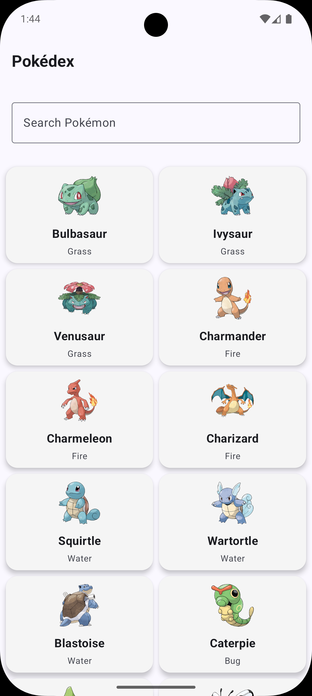
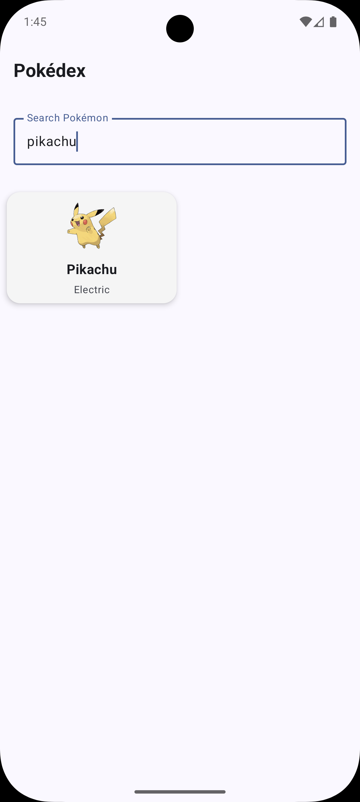
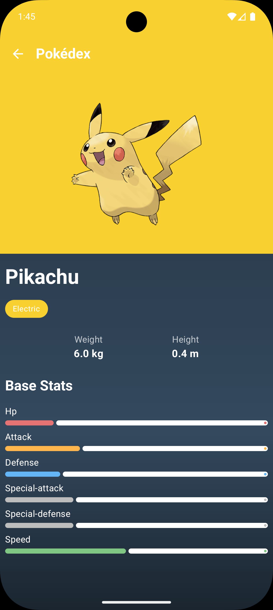

# Pokedex

A modern Android application demonstrating a clean, scalable architecture for browsing Pokémon data.

## Screenshots

| Home | Search | Detail |
|------|--------|--------|
|  |  |  |

## Features

- Browse Pokémon list with pagination
- Search Pokémon by name
- View Pokémon details (stats, abilities, artwork)
- Offline-first with Room caching
- Material Design 3 UI with theme tokens

## Tech Stack

- Jetpack Compose (UI)
- Hilt (DI)
- Room (Local DB)
- Retrofit + OkHttp (Networking)
- Coroutines + Flow (Concurrency)
- Paging 3 (Pagination)
- Coil (Images)
- JUnit, Mockito, Coroutines Test (Testing)

## Architecture & Modules

Clean Architecture with clear boundaries:

- `app` – presentation (Compose UI, ViewModels, navigation)
- `domain` – business logic (entities, use cases, repository interfaces)
- `data` – data sources (Retrofit, Room), mappers, repository implementations

```
UI (app)  →  UseCases (domain)  →  Repositories (data)
           ←        Models (domain)       ←  DTO/Entities (data)
```

### Project Structure

```
├── app/
│   └── src/main/java/com/ikiugu/pokedex/
│       ├── presentation/      # UI + ViewModels
│       └── navigation/        # Typed routes
├── domain/
│   └── src/main/java/com/ikiugu/pokedex/domain/
│       ├── entity/            # Domain models
│       ├── repository/        # Interfaces
│       └── usecase/           # Business logic
└── data/
    └── src/main/java/com/ikiugu/pokedex/data/
        ├── remote/            # API + DTOs + ImageUrlBuilder
        ├── local/             # Room DB/DAO/entities
        ├── repository/        # Impl
        └── di/                # Data DI
```

## Requirements

- Android Studio (Giraffe+ recommended)
- JDK 17
- minSdk 24, targetSdk 36

## Setup & API

This app uses the public [PokeAPI](https://pokeapi.co/). No keys required.

## Build & Run

```bash
# Debug build
./gradlew assembleDebug

# Release build
./gradlew assembleRelease

# Clean build
./gradlew clean
```

## Testing

```bash
# All tests
./gradlew test

# Per module
./gradlew :domain:test
./gradlew :data:test
./gradlew :app:test
```

Each module hosts its own tests:

- Domain: use case validation and business rules
- Data: repository behavior, mappers
- App: ViewModel logic

## Performance

The project includes Gradle optimizations to reduce build times:

- Configuration cache, build cache, and parallel execution
- Incremental KSP/KAPT and Kotlin compilation
- Non-transitive R classes and R8 optimizations

## Highlights

- Typed navigation routes (no stringly-typed paths)
- Theme tokens and Dimens for consistent styling (no magic numbers)
- SnapshotFlow for scroll-based effects (avoids LaunchedEffect restarts)
- Centralized ImageUrlBuilder for official artwork URLs
- Extracted DB name and optional SQLCipher hook

---

Note: A single-module variant with Clean Architecture is available on the
[feature/non-modular branch](https://github.com/ikiugu/pokedex/tree/feature/non-modular).
